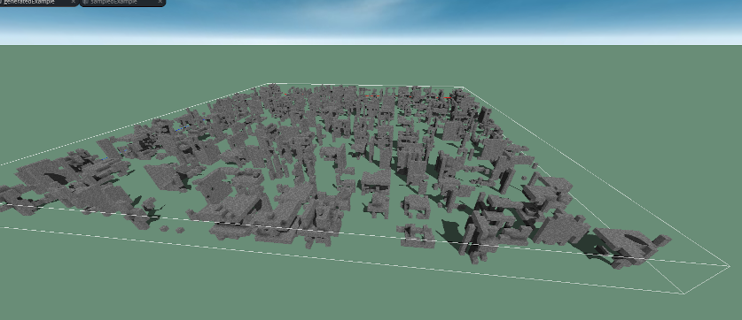

# Minecraft-GAN-City
Minecraft "city" generator using a tensorflow GAN.

A somewhat-failed attempt at training a neural network to build a city in Minecraft. Made for the [GDMC Competition](http://gendesignmc.engineering.nyu.edu/). Outputs an MCEdit schematic compatible with Minecraft version 1.2.

Yeah, it doesn't look much like a city, I know.

## Expectation:

1. Load human-generated Minecraft buildings from structure files.
1. Export samples from human data to use as a training dataset. 
1. Train a GAN to generate Minecraft buildings.
1. Use image completion (inpainting) to place buildings on terrain and extend them to arbitrary sizes.
1. Export the result to a structure file.

## Reality:
1. Load human-generated Minecraft buildings from structure files.
1. Export samples from human data to use as a training dataset. 
1. Train a GAN to generate things that sorta kinda look like Minecraft buildings.
1. Uh... just throw those things randomly around the terrain.
1. Export the result to a structure file.

# How to run it
#### Setup dev environment.
I'm gonna assume you kinda know what you're doing. The [tensorflow quickstart](https://www.tensorflow.org/tutorials/quickstart/beginner) might be useful. This repo is unsupported, don't @ me if you can't figure it out lol.
- Install Python 3 and miniconda.
- Install [the appropriate CUDA driver for tensorflow](https://www.tensorflow.org/install/gpu)
- Create a new conda environment. 
  - conda install tensorflow-gpu-2.1.0
  - conda install pillow-7.1.2
  - pip install nbtlib=1.7.0
 
#### Sample your training data.

Using MCEdit, export a section of terrain from a Minecraft world of your choice as a .structure file. I included a slice of [Project Zearth](https://www.planetminecraft.com/project/zeon-city/), pictured below. 

Run **WorldSampler.py**. 

This will load the Minecraft structure, and take a large number of samples from it. The samples will be processed to remove extraneous data, then filtered to remove samples that are excessively empty/filled. Finally, the samples are exported as a numpy array to a .npy file. 

This will also export a structure file that can be used to preview your samples.

This is what our GAN will try to generate. 

#### Train a GAN
Run **MinecraftGAN.py**.

This will load up your npy file of samples, create a GAN model using tensorflow, and start to train the model to generate Minecraft structures. 

This will take a while, depending on your GPU, and the various settings. Like, a few hours or more. Luckily, we will export checkpoints and crappy image previews along the way. Training checkpoints will be output to a folder named training_checkpoints_8x. 

#### Preview your output in a structure file
Run **MinecraftGAN_export.py**.

This will load your most recent model checkpoint, and use it to generate a grid of "buildings" in a structure file. It should look something like this:

Kinda close, right? 

#### Generate a "city".
Run **SettlementGen.py**.

This will open up a structure file of empty terrain, generate a bunch of "buildings" using the GAN model, place the buildings randomly onto the terrain, the export a new structure file. 

Before: 

And After:

It sure is something.

# Post-Mortem

While I'm disappointed with the results, I still think there's some things worth sharing about the project. 

Setting up the environment was a struggle. My initial goal was to use the tutorial provided by GDMC to create an MCEdit filter. Unfortunately, MCEdit is old, abandoned, and written using Python 2. I don't like Python 2, it's not compatible with Python 3, and it's deprecated which makes it hard to even download and install stuff. Popular neural network tools all use Python 3. Most AI tutorials, papers, and example code uses the newer versions. 

After giving up on MCEdit, someone on the GDMC Discord suggested instead creating a program that simply loads a Minecraft structure file, generates a city in it, and outputs a new structure file. This approach was much easier, and allowed me to use Python 3. I found an [nbtschematic](https://github.com/cbs228/nbtschematic/blob/master/nbtschematic/schematic.py) Python library that made it relatively easy to load .schematic files exported from MCEdit. Conveniently, I could also use [cubical.xyz](https://cubical.xyz/) to preview schematics.

Next, I started with a survey of the research. I could not find any other projects that generate Minecraft worlds using neural networks. I did find a decent amount of research working with voxel data on neural networks. I found a number of papers using [ShapeNet](https://www.shapenet.org/) data to generate 3D objects, but the aesthetic results of these networks was very disappointing. None of them seemed capable of generating interesting novel data. Instead, it's just a bunch of papers that generate blobby chairs in different rotations. 

Instead, I turned to image research, which I figured I could simply extend from 2D to 3D. Image-based neural networks can produce some extremely aesthetically interesting results. GANs seemed particularly well-suited to generating large amounts of novel data. I was also seduced by the results of GAN image extension, which was able to take a small image and extend it or fill-in areas. This seemed very well-suited for creating connected structures that blend with terrain in a large continous Minecraft world. 

I decided to start with a minimum viable product. I would generate buildings of pure stone. Dealing with hundreds of different block types seemed problematic, even with a large training dataset. I also wanted to sidestep the issues of Block data and Entity data (Minecraft data structures used to store additional info such as the orientation of a door block or a painting placed on a wall). Using simplified input data would also speed-up the process of training the GAN, allowing me to iterate faster on the network design. 

Finding a training dataset and processing it went well. A common challenge with neural network problems is finding a large enough training dataset. Typical datasets used for research can range from tens of thousands to tends of millions of samples (images, text passages, etc.). Luckily, there are many websites where I could download large Minecraft maps, some of them taking up gigabytes even when compressed. The main challenge of processing the data was determining "solid" versus "transparent" blocks. I wanted to ignore blocks like leaves and flowers. This wasn't particularly challenging on a technical level, but required a significant amount of manual effort to categorize block IDs. Numpy has many useful functions for this sort of thing. 

Even converted to pure stone, my training data looked quite impressive in a brutalist way. If I could generate interesting stone skyscrapers, I would be very pleased. I figured I could even apply some post-processing to the GAN output, add foliage or rubble to make it look like a post-apocalyptic cityscape. 

To train the network, I based my network on [Tensorflow's DCGAN example using the MNIST dataset](https://www.tensorflow.org/tutorials/generative/dcgan). This dataset uses relatively small, high-contrast black-and-white images of numbers. That's relatively similar to my Minecraft data. Also important: the network trained fairly fast on my PC, and the output looks pretty good! As a proof of concept, I took 1-voxel-thick slices from my Minecraft training data, and trained the network to generate 2D "floorplans". This worked decently well, although it was difficult to get a sense of the fidelity when the 2D input data wasn't particularly impressive. 

Making the jump to 3D is when things started to break down. Building the 3D version of the network was somewhat difficult, this being my first time using Tensorflow. When I eventually got it working, I struggled to get results that looked anywhere close to my training data. Also, the 3D network took much longer to train. I experimented with 16x16x16, 12x12x12, and finally 8x8x8 voxel output sizes. The smallest size was signficiantly faster, and I wasn't able to notice any visual improvement from using the larger networks. I spent a lot of time messing with the network design, tweaking hyperparameters, trying diferent datasets, and reading various tips for training GANs. I eventually got to something that looks a bit like a building, but still not really recognizable. 

I never reached a point where I was satisfied with the output from the standard GAN, so I didn't think it would be useful to start trying infill or image extension techniques. It would be difficult to even tell if things were working properly. 

I decided to take my building-like objects and put them on some Minecraft terrain anyways. The end result might not look particularly impressive, but there's a lot going on behind it! Looking closer at the generated content, some patterns are visible, you can almost make out walls, floors, maybe the repeating patterns of windows or facades. Is it a city? Uh... no. But I think you can tell that there's a little bit more than just random noise or generator artifacts. 

# Conclusions

* Tooling:
  * Python 2 bad.
  * Python 3 good. 
  * Tensorflow 2 is cool.
  * Numpy is great. 
  * MCEdit might be more trouble than it's worth.
* There is a huge amount of Minecraft data available. There might be more publicly-available player-created Minecraft content on the internet than any other game. This is a massive untapped resource.
  * Some block types and entities present problems. 
  * This might require the combination of multiple approaches: one AI system to generate buildings, one to pick materials, one to place doors and other furniture, one to write text for signs and books, etc. It might be interesting to pair traditional AI, neural networks, or even human input during the process. 
* Minecraft data is very different from more common machine learning datasets. Existing techniques may not transfer over cleanly to Minecraft. 
* There is not much research into using neural networks to generate aesthetically-pleasing 3D content.
* Using 2D GAN techniques with 3D Minecraft data had disappointing results, but it wasn't quite a complete failure. 
* A consumer GPU is pretty decent at modest neural network tasks. 
